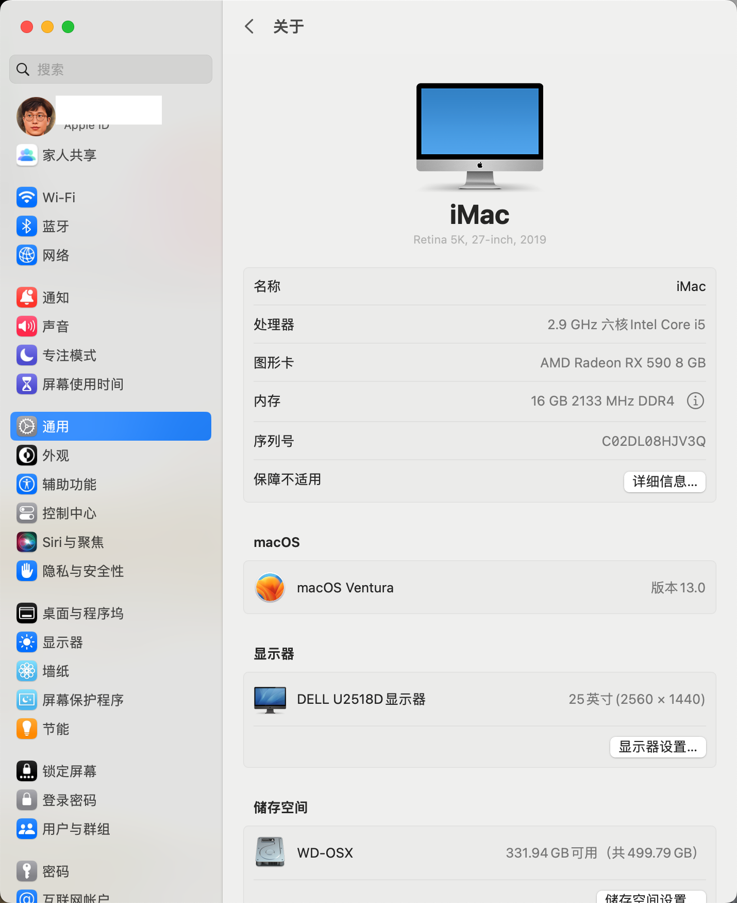
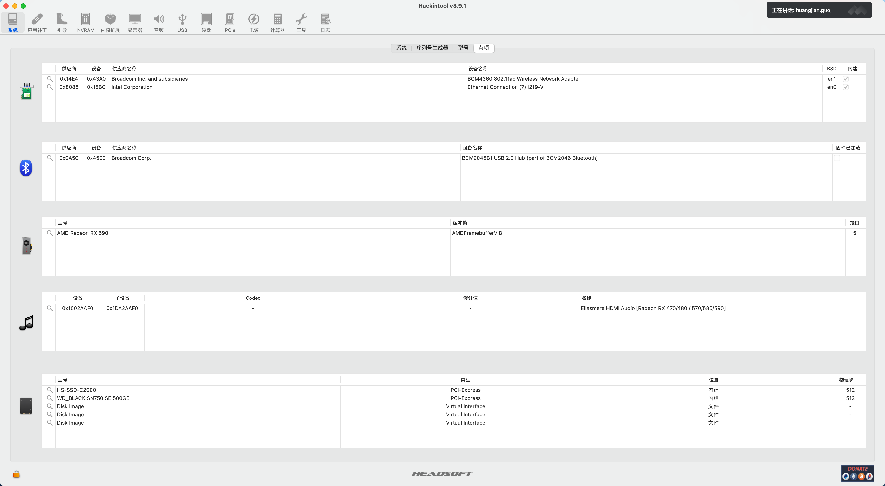
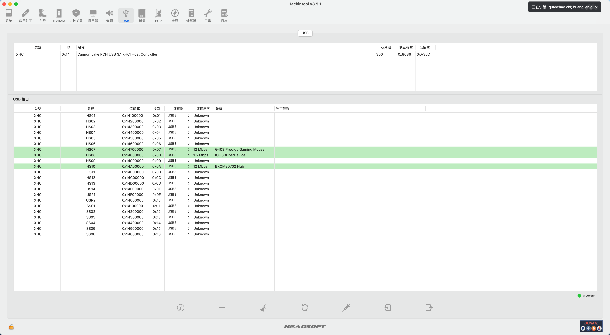

# Hackintosh EFI with OpenCore
**Clover EFI 参考 [clover branch](https://github.com/liangzhenduo0608/hackintosh-efi/tree/clover)**

## 配置
+ 主板：技嘉B360M AORUS PRO
+ CPU：Intel® Core™ i5-9400F Processor
+ 显卡：蓝宝石RX590 8G D5 白金版 OC
+ 内存：内存：宇瞻（Apacer）DDR4 2666  8G×2
+ 固态硬盘：西部数据SN750SE 550G
+ 蓝牙&无线网卡: BCM94360CS2两天线1200M
+ 电源：海韵 PRIME ULTRA 550W

## 更新

+ macOS Monterey 13.0
+ [OpenCore](https://github.com/acidanthera/OpenCorePkg/releases) v0.8.6
+ [OcBinaryData](https://github.com/acidanthera/OcBinaryData)
+ [Lilu](https://github.com/acidanthera/Lilu/releases) v1.6.2
+ [WhateverGreen](https://github.com/acidanthera/WhateverGreen/releases) v1.6.1
+ [AppleALC](https://github.com/acidanthera/AppleALC/releases) v1.7.5
+ [VirtualSMC](https://github.com/acidanthera/VirtualSMC/releases) v1.3.0
+ [IntelMausi](https://github.com/acidanthera/IntelMausi/releases) v1.0.7
+ [NVMeFix](https://github.com/acidanthera/NVMeFix/releases) v1.1.0

