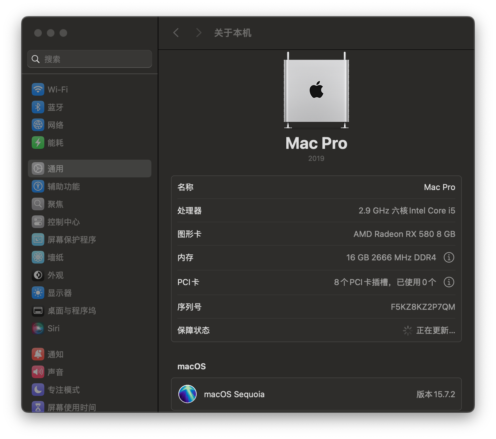
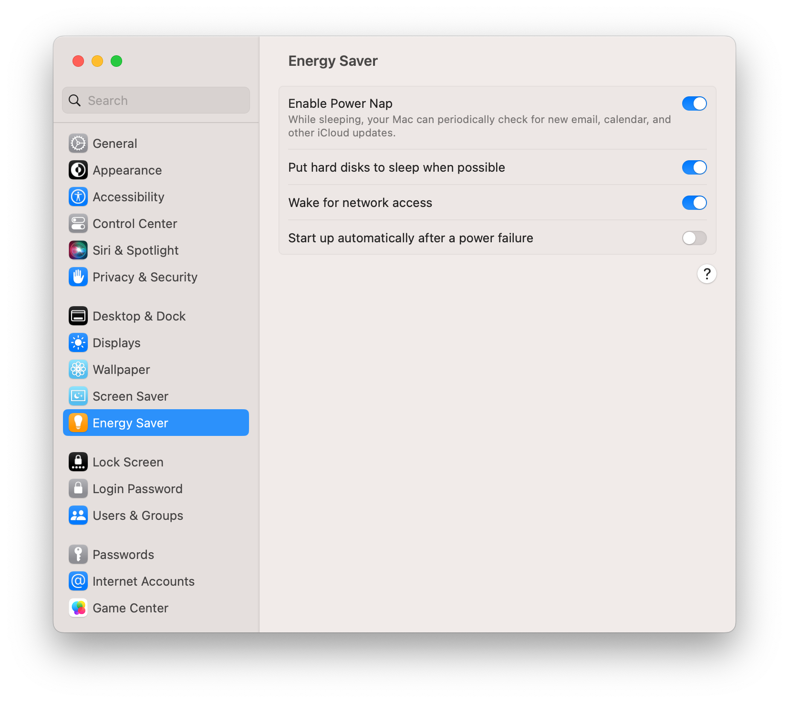
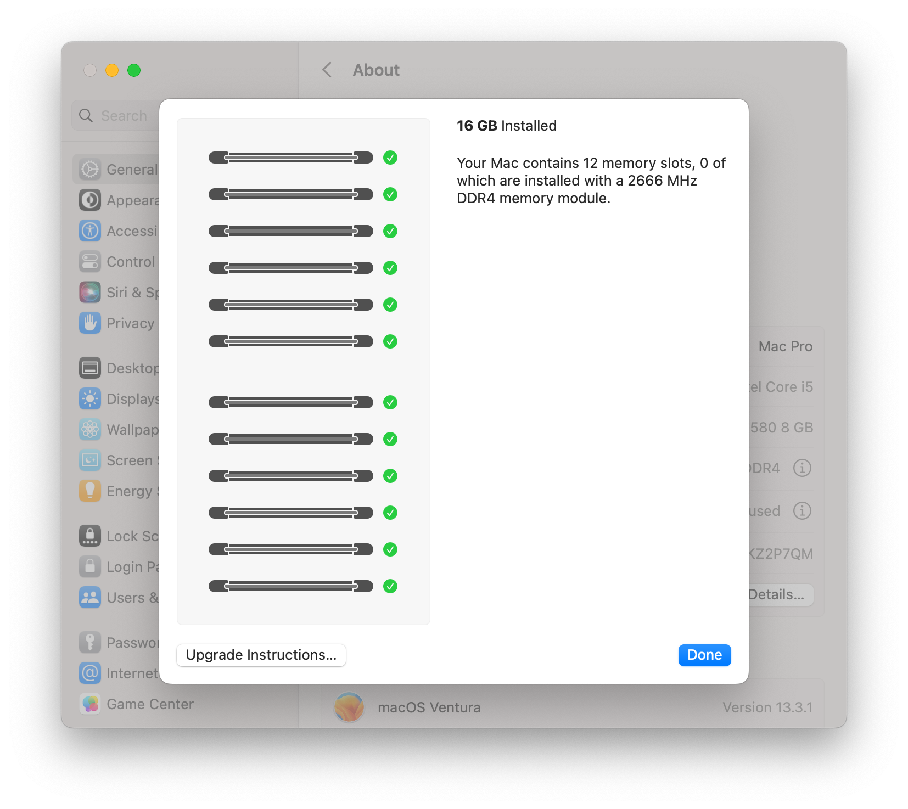
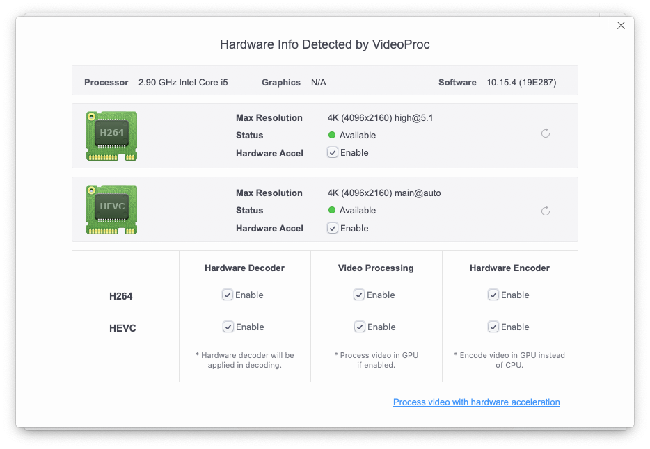

# Hackintosh EFI with OpenCore
**Clover EFI 参考 [clover branch](https://github.com/liangzhenduo0608/hackintosh-efi/tree/clover)**

## 配置
+ 主板：技嘉B360M AORUS PRO
+ CPU：Intel® Core™ i5-9400F Processor
+ 显卡：蓝宝石RX580 8G D5 白金版 OC
+ 内存：十铨DELTA RGB DDR4 3000 8G×2
+ 固态硬盘：海康威视C2000 1TB
+ 机械硬盘：东芝DT01ACA300 3TB
+ 蓝牙&无线网卡：Broadcom BCM94360CS2
+ 电源：海韵FOCUS+ 550FX 550W

## 更新

+ macOS Monterey 12.6
+ [OpenCore](https://github.com/acidanthera/OpenCorePkg/releases) v0.8.5
+ [OcBinaryData](https://github.com/acidanthera/OcBinaryData)
+ [Lilu](https://github.com/acidanthera/Lilu/releases) v1.6.2
+ [WhateverGreen](https://github.com/acidanthera/WhateverGreen/releases) v1.6.1
+ [AppleALC](https://github.com/acidanthera/AppleALC/releases) v1.7.5
+ [VirtualSMC](https://github.com/acidanthera/VirtualSMC/releases) v1.3.0
+ [IntelMausi](https://github.com/acidanthera/IntelMausi/releases) v1.0.7
+ [NVMeFix](https://github.com/acidanthera/NVMeFix/releases) v1.1.0

